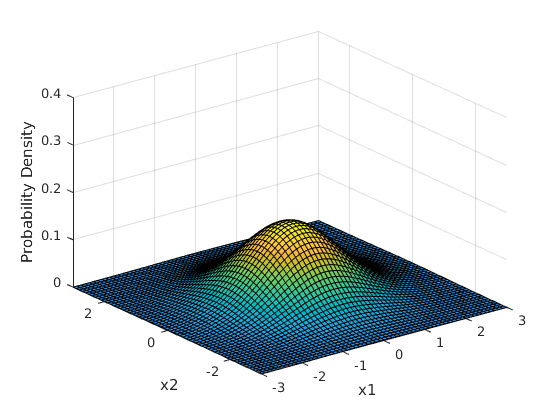

## Theory
The Multivariate Normal Distribution (MVN) is a generalization of the
univariate normal distribution to multiple dimensions. If we consider the
random variable as a vector the probability density function of the MVN is
given as:


where  the random variable,  the mean of the distribution,
 the covariance matrix and  the space of symmetric positive
definite nxn matrices.

In the following figure you can see the plot of the pdf for the two-dimensional
case zero mean and the identity matrix as the convariance.



The pdf of the distribution can provide as with the probability for the random
variable to have the value . Except from this information, some practical
applications require to generate random vectors based on this distribution.

For this, we basically produce data from the normal distribution around zero
with identity convariance matrix and then we transform this data to the given
statistics.

Based on the [Central Limit
Theorem](https://en.wikipedia.org/wiki/Central_limit_theorem) we can produce a
random number x, that belongs to the Guassian Distribution N(0, 1) by producing p random
numbers k which belong to the uniform distribution U(0, 1):


The bigger the number p the better we approximate the guassian distribution.

Thus, if we produce a vector of n such numbers this vector will be a point
belonging to the Multivariate Guassian Distribution N(0, I), i.e. with mean the
zero vector and convariance the identity matrix.

These random vectors will be a high-dimensional sphere around zero. We can
transform this vectors x to vectors y which belong to any MVN with any mean and
convariance matrix by:


where  a diagonal matrix with the eigenvalues of the convariance
matrix as the diagonal elements and  matrix with the eigenvectors of
the convariance matrix at its column.

## Implementation in C++

We will use the Eigen library for this implementation. Assume that you create
an Mvn class which will implement our MVN:

```cpp
class Mvn
{
public:
  Mvn(const Eigen::VectorXd& mu,
      const Eigen::MatrixXd& s);
  ~Mvn();
  double pdf(const Eigen::VectorXd& x) const;
  Eigen::VectorXd sample(unsigned int nr_iterations = 20) const;
  Eigen::VectorXd mean;
  Eigen::MatrixXd sigma;
};
```

We need to implement the pdf of the distribution and the function for sampling
random data. The implementation of the pdf just implements the formula from the
theory:

```cpp
double Mvn::pdf(const Eigen::VectorXd& x) const
{
  double n = x.rows();
  double sqrt2pi = std::sqrt(2 * M_PI);
  double quadform  = (x - mean).transpose() * sigma.inverse() * (x - mean);
  double norm = std::pow(sqrt2pi, - n) *
                std::pow(sigma.determinant(), - 0.5);

  return norm * exp(-0.5 * quadform);
}
```

We create a basic unit test for the above function in order to test it (we are using `gtest` here):

```cpp
TEST(TestMvn, TestPdf)
{
  // Define the covariance matrix and the mean
  Eigen::MatrixXd sigma(2, 2);
  sigma <<   1, 0.1,
           0.1, 1;
  Eigen::VectorXd mean(2);
  mean << 0, 0;
  Mvn mvn(mean, sigma);

  Eigen::VectorXd test(2);
  test << 0, 0;
  EXPECT_NEAR(mvn.pdf(test), 0.16, 1e-4);

  test << -0.6, -0.6;
  EXPECT_NEAR(mvn.pdf(test), 0.1153, 1e-4);
}
```

For sampling we first generate vectors from the distribution with zero mean and
identity covariance. The accuracy of the approximation of this distribution is
based on the number of the iterations. The trade off here is that by increasing
the accuracy we are losing speed and performance. Then we transform (translate
and rotate in the multidimensional space) these points based on the given mean
and covariance matrix as described above.

```cpp
Eigen::VectorXd Mvn::sample(unsigned int nr_iterations) const
{
  double n = mean.rows();

  // Generate x from the N(0, I) distribution
  Eigen::VectorXd x(n);
  Eigen::VectorXd sum(n);
  sum.setZero();
  for (unsigned int i = 0; i < nr_iterations; i++)
  {
    x.setRandom();
    x = 0.5 * (x + Eigen::VectorXd::Ones(n));
    sum = sum + x;
  }
  sum = sum - (static_cast<double>(nr_iterations) / 2) * Eigen::VectorXd::Ones(n);
  x = sum / (std::sqrt(static_cast<double>(nr_iterations) / 12));

  // Find the eigen vectors of the covariance matrix
  Eigen::SelfAdjointEigenSolver<Eigen::MatrixXd> eigen_solver(sigma);
  Eigen::MatrixXd eigenvectors = eigen_solver.eigenvectors().real();

  // Find the eigenvalues of the covariance matrix
  Eigen::MatrixXd eigenvalues = eigen_solver.eigenvalues().real().asDiagonal();
  
  // Find the transformation matrix
  Eigen::SelfAdjointEigenSolver<Eigen::MatrixXd> es(eigenvalues);
  Eigen::MatrixXd sqrt_eigenvalues = es.operatorSqrt();
  Eigen::MatrixXd Q = eigenvectors * sqrt_eigenvalues;

  return Q * x + mean;
}
```

The unit test here involves the sampling of a large number of points from the
distribution and calculating the mean vector and the covariance matrix of these
points. The calculated mean and convariance should approximate the statistics
of the true distribution in order to trust this function.

```cpp
TEST(TestMvn, TestSampling)
{
  // Define the covariance matrix and the mean
  Eigen::MatrixXd sigma(2, 2);
  sigma << 10, 7,
            7, 5;
  Eigen::VectorXd mean(2);
  mean << 2, 2;
  Mvn mvn(mean, sigma);

  // Sample a number of points
  const unsigned int points = 1000;
  Eigen::MatrixXd x(2, points);
  Eigen::VectorXd vector(2);
  for (unsigned i = 0; i < points; i++)
  {
    vector = mvn.sample(200);
    x(0, i) = vector(0);
    x(1, i) = vector(1);
  }

  // Calculate the mean and convariance of the produces sampled points
  Eigen::VectorXd approx_mean(2);
  Eigen::MatrixXd approx_sigma(2, 2);
  approx_mean.setZero();
  approx_sigma.setZero();

  for (unsigned int i = 0; i < points; i++)
  {
    approx_mean  = approx_mean  + x.col(i);
    approx_sigma = approx_sigma + x.col(i) * x.col(i).transpose();
  }

  approx_mean  = approx_mean  / static_cast<double>(points);
  approx_sigma = approx_sigma / static_cast<double>(points);
  approx_sigma = approx_sigma - approx_mean * approx_mean.transpose();

  // Check if the statistics of the sampled points are close to the statistics
  // of the given distribution.
  EXPECT_TRUE(approx_mean.isApprox(mean, 5e-1));
  EXPECT_TRUE(approx_sigma.isApprox(sigma, 5e-1));
}
```

The above is the basic premise. Of course the code can be improved in multiple
ways, such as adding error handling for the input (the dimensions of the input
vectors should be equal to the dimensions of the mean and covariance etc).

